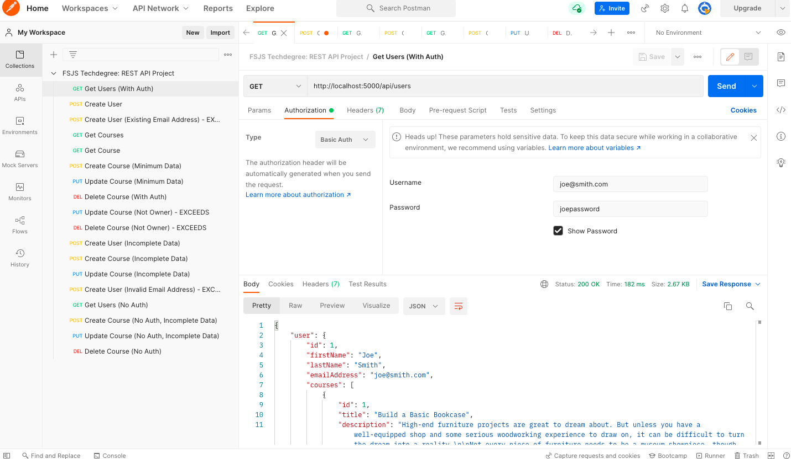

# rest-api

Rest API using Express

## TABLE OF CONTENTS

- [rest-api](#rest-api)
  - [TABLE OF CONTENTS](#table-of-contents)
  - [USAGE](#usage)
  - [EXAMPLE](#example)
  - [MODLES](#modles)
    - [User (User.js)](#user-userjs)
    - [Course (Course.js)](#course-coursejs)
  - [ROUTES](#routes)
    - [/api/users (users-routes.js)](#apiusers-users-routesjs)
      - [GET](#get)
      - [POST](#post)
    - [/api/courses (courses-routes.js)](#apicourses-courses-routesjs)
      - [GET](#get-1)
      - [POST](#post-1)
      - [PUT](#put)
      - [DELETE](#delete)
  - [MIDDLEWARE](#middleware)
    - [Authenticate User (auth-user.js)](#authenticate-user-auth-userjs)

## USAGE

1. Install dependencies using "npm install"
2. Seed database using "npm run seed"
3. Start application using "npm start"
4. Use POSTMAN to test the Rest API
   - Use the "RESTAPI.postman_collection.json" file to run test cases in POSTMAN
5. Use localhost port 5000
6. Below under routes are descriptions of how each route and method work
   - [Routes Link](##routes)

## EXAMPLE

## MODLES

### User (User.js)

    Attributes:  firstName, lastName, emailAddress, password, courses (User one-to-many Courses association)

### Course (Course.js)

    Attributes: title, description, estimatedTime, materialsNeeded, userId (Courses many-to-one User association)

## ROUTES

### /api/users (users-routes.js)

#### GET

    The GET /api/users route returns all properties and values for the currently authenticated User, includeing all courses associated with the user, with a 200 Ok HTTP status code.

#### POST

    The POST /api/users route creates a new user, set the Location header to "/", returning a 201 Created HTTP status code and no content.

### /api/courses (courses-routes.js)

#### GET

    The GET /api/courses route returns all courses including the User associated with each course and a 200 Ok HTTP status code.

    The GET /api/courses/:id route returns the corresponding course, based on the :id param, including the User associated with that course and a 200 Ok HTTP status code.

#### POST

    The POST /api/courses route creates a new course, sets the Location header to the URI for the newly created course, and returns a 201 Created HTTP status code and no content.

#### PUT

    The PUT /api/courses/:id route updates the corresponding course, based on the :id param, and returns a 204 HTTP status code and no content.

#### DELETE

    The DELETE /api/courses/:id route deletes the corresponding course and returns a 204 No Content HTTP status code and no content.

## MIDDLEWARE

### Authenticate User (auth-user.js)

    Users are authenticated before they are allowed to get data on the current user or before the user can create, update, or delete courses.

    The custom middleware function authenticates the user credentials from the requests's Authorization header.

    If the authentication is successful, the user is added to the Request object and next() is called.
    Else if the authentication fails a 401 HTTP status code and generic “Access Denied” message is returned.

    The custom middleware authenticates the following routes:
      - /api/users GET
      - /api/courses POST
      - /api/courses/:id PUT
      - /api/courses/:id DELETE
